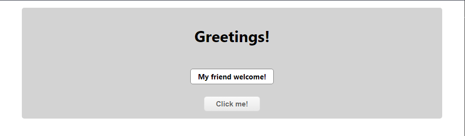

# Greetings!

>  Simple Rails + React app where we display greetings messages using a API created on Rails and frontend using React

## Main Page



### 🛠️ Built using
    - Ruby
    - Ruby On Rails
    - Rubocop
    - PostgreSQL
    - Github
    - RubyMine
    - CSS3
    - React
    - Redux

## 🏁  Getting Started

To get a local copy up and running follow these simple example steps.

## ✅ Prerequisites 

* Make sure that **Ruby Environment** is installed in your computer (try to run _ruby_ from your prompt), if not you can install it from [here.](https://www.ruby-lang.org/en/downloads/)

* [Download](https://github.com/kensayo/hello-rails-react/archive/refs/heads/development.zip) and unzip **or** [clone this repository](https://docs.github.com/es/github/creating-cloning-and-archiving-repositories/cloning-a-repository)


## ⚙️ Setup

- After clone or download the repository move to the root of the proyect
- Open a terminal there and run the next commands
```
// Install dependecies
bundle install
// Install Node JS dependecies
npm install
// Create the database
rails db:create
// Migrate the tables
rails db:migrate
// Populate the database
rails db:seed
// Start the server
rails server
```

## 💡 Usage

- Just go to [http://localhost:3000/](http://localhost:3000/)

## 🌐 API Endpoint


- [http://localhost:3000/v1/message](http://localhost:3000/v1/message)


## 👤 Kenny Ortega

- GitHub: [kensayo](https://github.com/kensayo)
- Twitter: [@kensayo](https://twitter.com/kensayo)
- LinkedIn: [LinkedIn](https://www.linkedin.com/in/kennyortega/)


## Contributions and issues are welcome!

